<div class="MCWHeader1">
Containers and DevOps
</div>

<div class="MCWHeader2">
Before the hands-on lab setup guide
</div>

<div class="MCWHeader3">
August 2018
</div>


Information in this document, including URL and other Internet Web site references, is subject to change without notice. Unless otherwise noted, the example companies, organizations, products, domain names, e-mail addresses, logos, people, places, and events depicted herein are fictitious, and no association with any real company, organization, product, domain name, e-mail address, logo, person, place or event is intended or should be inferred. Complying with all applicable copyright laws is the responsibility of the user. Without limiting the rights under copyright, no part of this document may be reproduced, stored in or introduced into a retrieval system, or transmitted in any form or by any means (electronic, mechanical, photocopying, recording, or otherwise), or for any purpose, without the express written permission of Microsoft Corporation.

Microsoft may have patents, patent applications, trademarks, copyrights, or other intellectual property rights covering subject matter in this document. Except as expressly provided in any written license agreement from Microsoft, the furnishing of this document does not give you any license to these patents, trademarks, copyrights, or other intellectual property.

The names of manufacturers, products, or URLs are provided for informational purposes only and Microsoft makes no representations and warranties, either expressed, implied, or statutory, regarding these manufacturers or the use of the products with any Microsoft technologies. The inclusion of a manufacturer or product does not imply endorsement of Microsoft of the manufacturer or product. Links may be provided to third party sites. Such sites are not under the control of Microsoft and Microsoft is not responsible for the contents of any linked site or any link contained in a linked site, or any changes or updates to such sites. Microsoft is not responsible for webcasting or any other form of transmission received from any linked site. Microsoft is providing these links to you only as a convenience, and the inclusion of any link does not imply endorsement of Microsoft of the site or the products contained therein.

© 2018 Microsoft Corporation. All rights reserved.

**Contents**
<!-- TOC -->

- [Requirements](#requirements)
- [Before the hands-on lab](#before-the-hands-on-lab)
    - [Task 1: Resource Group](#task-1-resource-group)
    - [Task 2: Create a Windows 10 Development VM](#task-2-create-a-windows-10-development-vm)
    - [Task 3: Install WSL (Bash on Ubuntu on Windows)](#task-3-install-wsl-bash-on-ubuntu-on-windows)
    - [Task 4: Create an SSH key](#task-4-create-an-ssh-key)
    - [Task 5: Create a build agent VM](#task-5-create-a-build-agent-vm)
    - [Task 6: Connect securely to the build agent](#task-6-connect-securely-to-the-build-agent)
    - [Task 7: Complete the build agent setup](#task-7-complete-the-build-agent-setup)
    - [Task 8: Create an Azure Container Registry](#task-8-create-an-azure-container-registry)
    - [Task 9: Create a Service Principal](#task-9-create-a-service-principal)
    - [Task 10: Create an Azure Kubernetes Service cluster](#task-10-create-an-azure-kubernetes-service-cluster)
    - [Task 11: Install Azure CLI](#task-11-install-azure-cli)
    - [Task 12: Install Kubernetes CLI](#task-12-install-kubernetes-cli)
    - [Task 13: Download the FabMedical starter files](#task-13-download-the-fabmedical-starter-files)

<!-- /TOC -->


## Requirements

1.  Microsoft Azure subscription must be pay-as-you-go or MSDN.

    - Trial subscriptions will *not* work.

    - You must have rights to create a service principal as discussed in Task 9: Create a Service Principal --- and this typically requires a subscription owner to log in. You may have to ask another subscription owner to login to the portal and execute that step ahead of time if you do not have the rights.

    - You must have enough cores available in your subscription to create the build agent and Azure Kurbernetes Service cluster in Task 5: Create a build agent VM and Task 10: Create an Azure Kubernetes Service cluster. You'll need eight cores if following the exact instructions in the lab, more if you choose additional agents or larger VM sizes. If you execute the steps required before the lab, you will be able to see if you need to request more cores in your sub.

2. A VisualStudio.com account.

3. Local machine or a virtual machine configured with:

    - A browser, preferably Chrome for consistency with the lab implementation tests.

    - Command prompt.

         i.  On Windows, you will be using Bash on Ubuntu on Windows, hereon referred to as WSL.

         ii. On Mac, all instructions should be executed using bash in Terminal.

4. You will be asked to install other tools throughout the exercises.

## Before the hands-on lab

**Duration**: 1 hour

You should follow all of the steps provided in this section *before* taking part in the hands-on lab ahead of time as some of these steps take time.

### Task 1: Resource Group

You will create an Azure Resource Group to hold most of the resources that you create in this hands-on lab. This approach will make it easier to clean up later. You will be instructed to create new resources in this Resource Group during the remaining exercises.

1.  In your browser, navigate to the **Azure Portal** (<https://portal.azure.com>).

2.  Select **+ Create a resource** in the navigation bar at the left.

    

3.  In the Search the Marketplace search box, type \"Resource group\" and press Enter.

    

4.  Select **Resource group** on the Everything blade and select **Create**.

    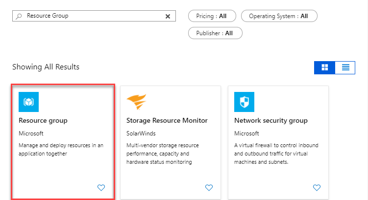

5.  On the new Resource group blade, set the following:

    a.  **Resource group name:** Enter something like "fabmedical-SUFFIX", as shown in the following screenshot.

    b.  **Subscription:** Select the subscription you will use for all the steps during the lab.

    c.  **Resource group location:** Choose a region where all Azure Container Registry SKUs are available, which is currently East US, West Central US, or West Europe, and remember this for future steps so that the resources you create in Azure are all kept within the same region.

    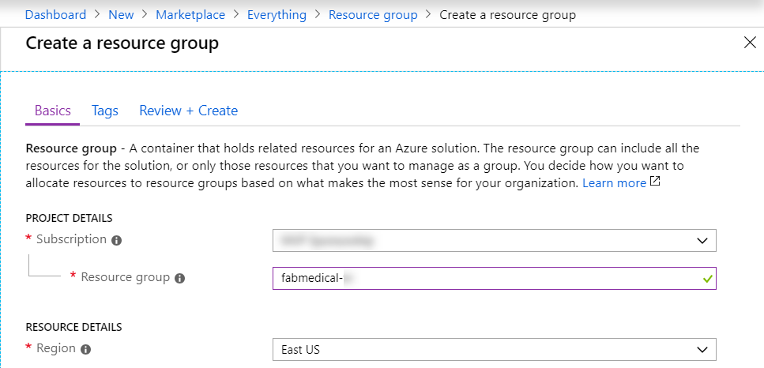

    d.  Select **Create**.

6.  When this completes, your Resource Group will be listed in the Azure Portal.

    

### Task 2: Create a Windows 10 Development VM

You will follow these steps to create a development VM (machine) for the following reasons:

-   If your operating system is earlier than Windows 10 Anniversary Update, you will need it to work with WSL as instructed in the lab.

-   If you are not sure if you set up WSL correctly, given there are a few ways to do this, it may be easier to create the development machine for a predictable experience.

> **NOTE: Setting up the development machine is optional for Mac OS since you will use Terminal for commands. Setting up the development machine is also optional if you are certain you have a working installation of WSL on your current Windows 10 VM.**

In this section, you will create a Windows 10 VM to act as your development machine. You will install the required components to complete the lab using this machine. You will use this machine instead of your local machine to carry out the instructions during the lab.

1.  From the Azure Portal, select **+ Create a resource**, type "**Windows 10**" in the Search the marketplace text box and press **Enter**.

    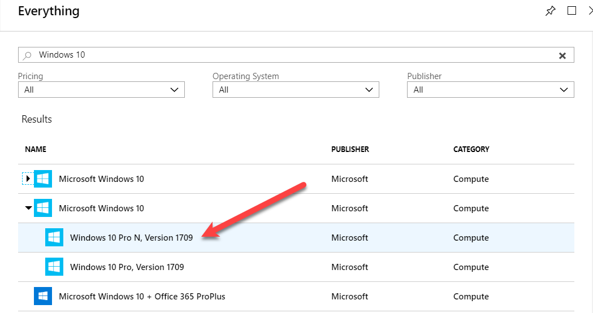

2.  Select **Windows 10 Pro N, Version 1709** and select **Create**.

3.  On the Basics blade of the Virtual Machine setup, set the following:

    -   **Name**: Provide a unique name, such as "fabmedicald-SUFFIX" as shown in the following screenshot.

    -   **VM disk type**: Leave as SSD.

    -   **User name**: Provide a user name, such as "adminfabmedical".

    -   **Password**: Provide a password, such as "Password\$123".

    -   **Confirm password**: Confirm the previously entered password.

    -   **Subscription**: Choose the same subscription you are using for all your work.

    -   **Resource group**: Choose Use existing and select the resource group you created previously.

    -   **Location**: Choose the same region that you did before.

    -   Select **OK** to complete the Basics blade.

    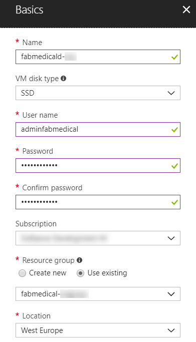

4.  From the Size blade search for "DS2_v2", choose **D2S\_V2 Standard** and **Select**.

    

5.  From the Settings blade, accept the default values for all settings and select **OK**.

6.  From the Create blade, you should see that validation passed and select **Create**.

    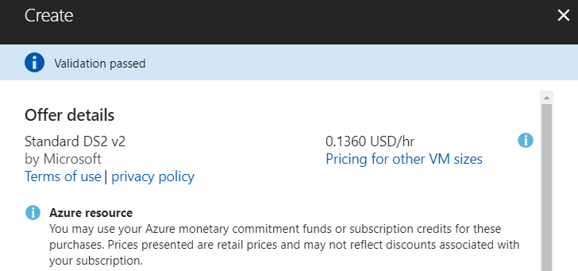

7.  The VM will begin deployment to your Azure subscription.

    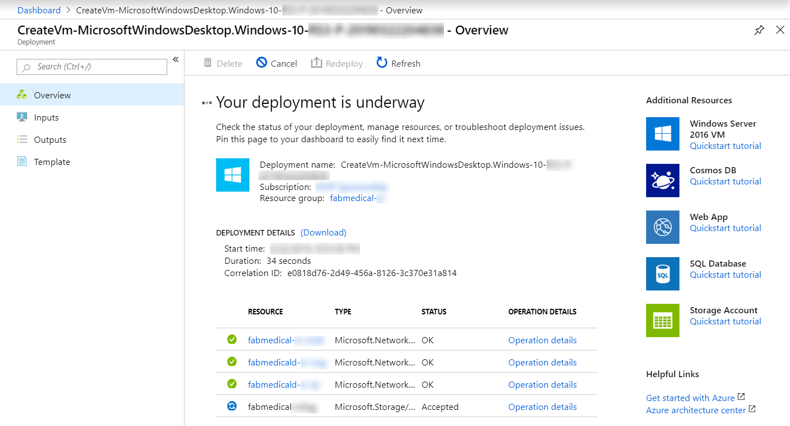

8.  Once provisioned, you will see the VM in your list of resources belonging to the resource group you created previously and select the new VM.

    

9.  In the Overview area for the VM, select Connect to establish a Remote Desktop Connection (RDP) for the VM.

    

10. Complete the steps to establish the RDP session and ensure that you are connected to the new VM.

### Task 3: Install WSL (Bash on Ubuntu on Windows)

>**NOTE: If you are using a Windows 10 development machine, follow these steps. For Mac OS you can ignore this step since you will be using Terminal for all commands.**

You will need WSL to complete various steps. A complete list of instructions for supported Windows 10 versions is available on this page:

<https://docs.microsoft.com/en-us/windows/wsl/install-win10>

### Task 4: Create an SSH key

In this section, you will create an SSH key to securely access the VMs you create during the upcoming exercises.

1.  Open a WSL command window.

    

    or

    

2.  From the command line, enter the following command to ensure that a directory for the SSH keys is created. You can ignore any errors you see in the output.

``` bash
    mkdir .ssh
```

3.  From the command line, enter the following command to generate an SSH key pair. You can replace "admin" with your preferred name or handle.

``` bash
   ssh-keygen -t RSA -b 2048 -C admin@fabmedical
```

4.  You will be asked to save the generated key to a file. Enter \".ssh/fabmedical\" for the name.

5.  Enter a passphrase when prompted, and **don't forget it**!

6.  Because you entered ".ssh/fabmedical", the file will be generated in the ".ssh" folder in your user folder, where WSL opens by default.

7.  Keep this WSL window open and remain in the default directory, you will use it in later tasks.

    

### Task 5: Create a build agent VM

In this section, you will create a Linux VM to act as your build agent. You will install Docker to this VM once it is set up, and you will use this VM during the lab to develop and deploy.

>**NOTE: You can set up your local machine with Docker however the setup varies for different versions of Windows. For this lab, the build agent approach simply allows for predictable setup.**

1. From the Azure Portal, select **+ Create a resource**, type "**Ubuntu**" in the Search the marketplace text box and press **Enter**.

    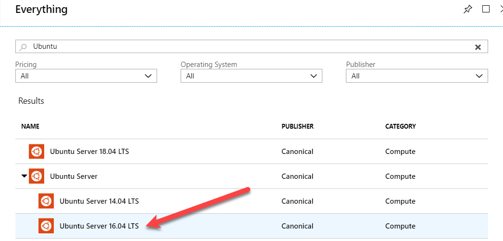

2. Select **Ubuntu Server 16.04 LTS** and select **Create**.

3. On the Basics blade of the Virtual Machine setup, set the following:

    -   **Name**: Provide a unique name, such as "fabmedical-SUFFIX" as shown in the following screenshot.

    -   **VM disk type**: Leave as SSD.

    -   **User name**: Provide a user name, such as "adminfabmedical".

    -   **Authentication** **type**: Leave as SSH public key.

    -   **SSH public key**: From your local machine, copy the public key portion of the SSH key pair you created previously, to the clipboard.

        -  From WSL, verify you are in your user directory shown as "**\~"**. This command will take you there:

            ``` bash
            cd ~
            ```

        - Type the following command at the prompt to display the public key that you generated:

            ``` bash
            cat .ssh/fabmedical.pub
            ```

            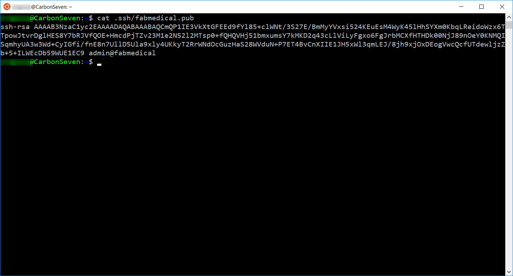

        - Copy the entire contents of the file to the clipboard.

            ``` bash
            cat .ssh/fabmedical.pub | clip.exe
            ```

        - Paste this value in the SSH public key textbox of the blade.

    -   **Login with Azure Active Directory**: Leave disabled.

    -   **Subscription**: Choose the same subscription you are using for all your work.

    -   **Resource group**: Choose Use existing and select the resource group you created previously.

    -   **Location**: Choose the same region that you did before.

    -   Select **OK** to complete the Basics blade.

    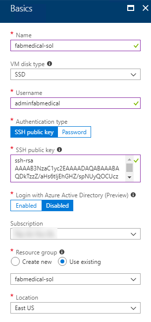

4. From the Size blade search for "D2S_v3" and **Select**.

    

5. From the Settings blade, accept the default values for most settings and select "SSH (22)" as a public inbound port, then select **OK**.

    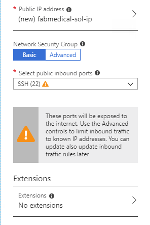

6. From the Create blade, you should see that validation passed and select **Create**.

    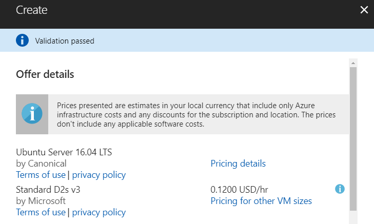

7. The VM will begin deployment to your Azure subscription.

    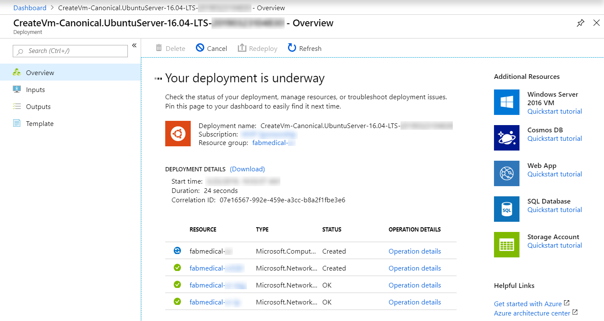

8. Once provisioned, you will see the VM in your list of resources belonging to the resource group you created previously.

    

### Task 6: Connect securely to the build agent

In this section, you will validate that you can connect to the new build agent VM.

1.  From the Azure portal, navigate to the Resource Group you created previously and select the new VM, fabmedical-SUFFIX.

2.  In the Overview area for the VM, take note of the public IP address for the VM.

    

3.  From your local machine, return to your open WSL window and make sure you are in your user directory **\~** where the key pair was previously created. This command will take you there:

    ``` bash
    cd ~
    ```

4.  Connect to the new VM you created by typing the following command:

    ``` bash
     ssh -i [PRIVATEKEYNAME] [BUILDAGENTUSERNAME]@[BUILDAGENTIP]
    ```

    Replace the bracketed values in the command as follows:

    -   [PRIVATEKEYNAME]: Use the private key name ".ssh/fabmedical," created above.

    -   [BUILDAGENTUSERNAME]: Use the username for the VM, such as adminfabmedical.

    -   [BUILDAGENTIP]: The IP address for the build agent VM, retrieved from the VM Overview blade in the Azure Portal.

    ``` bash
    ssh -i .ssh/fabmedical adminfabmedical@52.174.141.11
    ```

5.  When asked to confirm if you want to connect, as the authenticity of the connection cannot be validated, type "yes"

6.  When asked for the passphrase for the private key you created previously, enter this value

7.  You will connect to the VM with a command prompt such as the following. Keep this command prompt open for the next step.

    adminfabmedical\@fabmedical-SUFFIX:~$

    

>**NOTE: If you have issues connecting, you may have pasted the SSH public key incorrectly. Unfortunately, if this is the case, you will have to recreate the VM and try again.**

### Task 7: Complete the build agent setup

In this task, you will update the packages and install Docker engine.

1. Go to the WSL window that has the SSH connection open to the build agent VM.

2. Update the Ubuntu packages and install curl and support for repositories over HTTPS in a single step by typing the following in a single line command. When asked if you would like to proceed, respond by typing "y" and pressing enter.

    ``` bash
    sudo apt-get update && sudo apt install apt-transport-https ca-certificates curl software-properties-common
    ```

3. Add Docker's official GPG key by typing the following in a single line command:

    ``` bash
    curl -fsSL https://download.docker.com/linux/ubuntu/gpg | sudo apt-key add -
    ```
4. Add Docker's stable repository to Ubuntu packages list by typing the following in a single line command:

    ``` bash
    sudo add-apt-repository "deb [arch=amd64] https://download.docker.com/linux/ubuntu $(lsb_release -cs) stable"
    ```
5. Update the Ubuntu packages and install Docker engine, node.js and the node package manager in a single step by typing the following in a single line command. When asked if you would like to proceed, respond by typing "y" and pressing enter.

    ``` bash
    sudo apt-get update && sudo apt install docker-ce nodejs npm mongodb-clients
    ```
6. Now, upgrade the Ubuntu packages to the latest version by typing the following in a single line command. When asked if you would like to proceed, respond by typing "y" and pressing enter.

    ``` bash
    sudo apt-get upgrade
    ```

7. Install `docker-compose`

    ```bash
    sudo curl -L https://github.com/docker/compose/releases/download/1.21.2/docker-compose-`uname -s`-`uname -m` -o /usr/local/bin/docker-compose
    sudo chmod +x /usr/local/bin/docker-compose
    ```

8. When the command has completed, check the Docker version installed by executing this command. The output may look something like that shown in the following screen shot. Note that the server version is not shown yet, because you didn't run the command with elevated privileges (to be addressed shortly).

    ``` bash
    docker version
    ```

    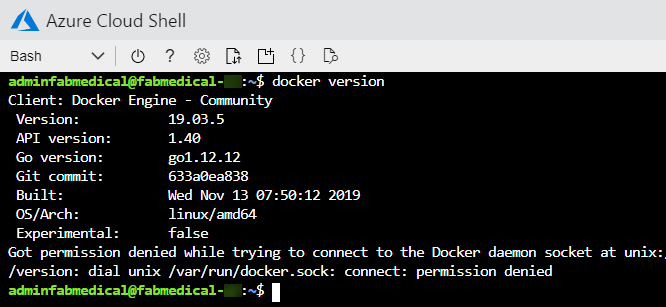

9. You may check the versions of node.js and npm as well, just for information purposes, using these commands:

    ``` bash
    nodejs --version

    npm -version
    ```

10. Install `bower`

    ```bash
    sudo npm install -g bower
    sudo ln -s /usr/bin/nodejs /usr/bin/node
    ```

11. Add your user to the Docker group so that you do not have to elevate privileges with sudo for every command. You can ignore any errors you see in the output.
    ``` bash
    sudo usermod -aG docker $USER
    ```

    

12. In order for the user permission changes to take effect, exit the SSH session by typing 'exit', then press \<Enter\>. Repeat the commands in Task 6: Connect securely to the build agent from step 4 to establish the SSH session again.

13. Run the Docker version command again, and note the output now shows the server version as well.

    

14. Run a few Docker commands:

    -   One to see if there are any containers presently running.
    ``` bash
    docker container ls
    ```

    -   One to see if any containers exist whether running or not.
    ``` bash
    docker container ls -a
    ```

15. In both cases, you will have an empty list but no errors running the command. Your build agent is ready with Docker engine running properly.

    

### Task 8: Create an Azure Container Registry

You deploy Docker images from a registry. To complete the hands-on lab, you will need access to a registry that is accessible to the Azure Kubernetes Service cluster you are creating. In this task, you will create an Azure Container Registry (ACR) for this purpose, where you push images for deployment.

1.  In the [Azure Portal](https://portal.azure.com/), select **+ Create a resource**, **Containers**, then click **Azure Container Registry**.

    

2.  On the Create container registry blade, enter the following:

    -   **Registry name:** Enter a name, such as "fabmedicalSUFFIX", as shown in the following screenshot.

    -   **Subscription:** Choose the same subscription you are using for all your work.

    -   **Resource group:** Choose Use existing and select the resource group you created previously.

    -   **Location:** Choose the same region that you did before.

    -   **Admin user:** Select Enable.

    -   **SKU:** Select Standard.

        

3.  Select **Create**.

4.  Navigate to your ACR account in the Azure Portal. As this is a new account, you will not see any repositories yet. You will create these during the hands-on lab.

    

### Task 9: Create a Service Principal

Azure Kubernetes Service requires an Azure Active Directory service principal to interact with Azure APIs. The service principal is needed to dynamically manage resources such as user-defined routes and the Layer 4 Azure Load Balancer. The easiest way to set up the service principal is using the Azure cloud shell.

> **NOTE: By default, creating a service principal in Azure AD requires account owner permission. You may have trouble creating a service principal if you are not the account owner.**

1.  Open cloud shell by selecting the cloud shell icon in the menu bar.

    

2.  The cloud shell will open in the browser window. Choose "Bash (Linux)" if prompted or use the left-hand dropdown on the shell menu bar to choose "Bash" (as shown).

    

3.  Before completing the steps to create the service principal, you should make sure to set your default subscription correctly. To view your current subscription type:

    ``` bash
    az account show
    ```

    

4.  To list all of your subscriptions, type:

    ``` bash
    az account list
    ```

    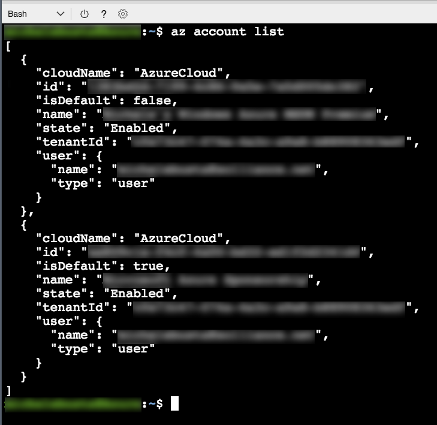

5.  To set your default subscription to something other than the current selection, type the following, replacing {id} with the desired subscription id value:

    ``` bash
    az account set --subscription {id}
    ```

6.  To create a service principal, type the following command, replacing {id} with your subscription identifier, and replacing suffix with your chosen suffix to make the name unique:

    ``` bash
    az ad sp create-for-rbac --role="Contributor" --scopes="/subscriptions/{id}" --name="Fabmedical-sp-{SUFFIX}"
    ```

7.  The service principal command will produce output like this. Copy this information; you will need it later.

    

### Task 10: Create an Azure Kubernetes Service cluster

In this task, you will create your Azure Kubernetes Service cluster. You will use the same SSH key you created previously to connect to this cluster in the next task.

1.  From the Azure Portal, select **+ Create a resource**, **Containers** and select **Kubernetes Service**.

    

2.  In the Basics blade provide the information shown in the screenshot that follows:

    > NOTE: You may need to scroll to see all values.

    * **Subscription**: Choose your subscription which you have been using throughout the lab.
    * **Resource group**: Select the resource group you have been using through the lab.
    * **Name**: Enter fabmedical-SUFFIX.
    * **Region**: Choose the same region as the resource group.
    * **Kubernetes version**: 1.9.6.
    * **DNS Prefix**: Enter fabmedical-SUFFIX.

        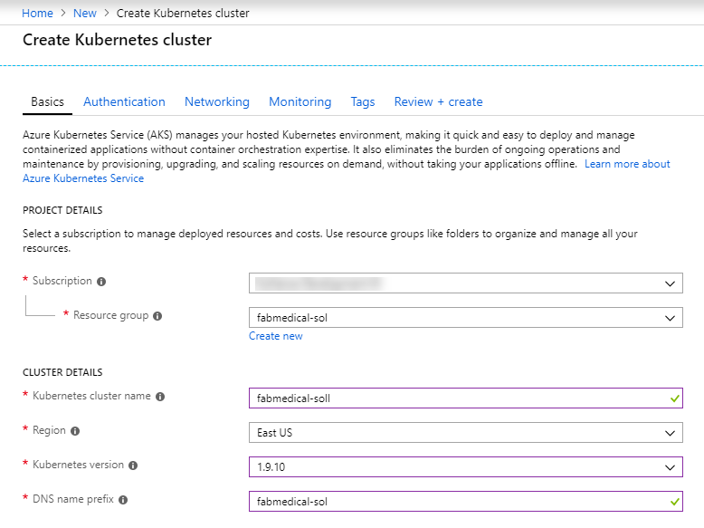

    * Configure your service principal.
    
        * **Service principal client ID**: Use the service principal “appId” from the previous step.
        * **Service principal client secret**: Use the service principal “password” from the previous step.

            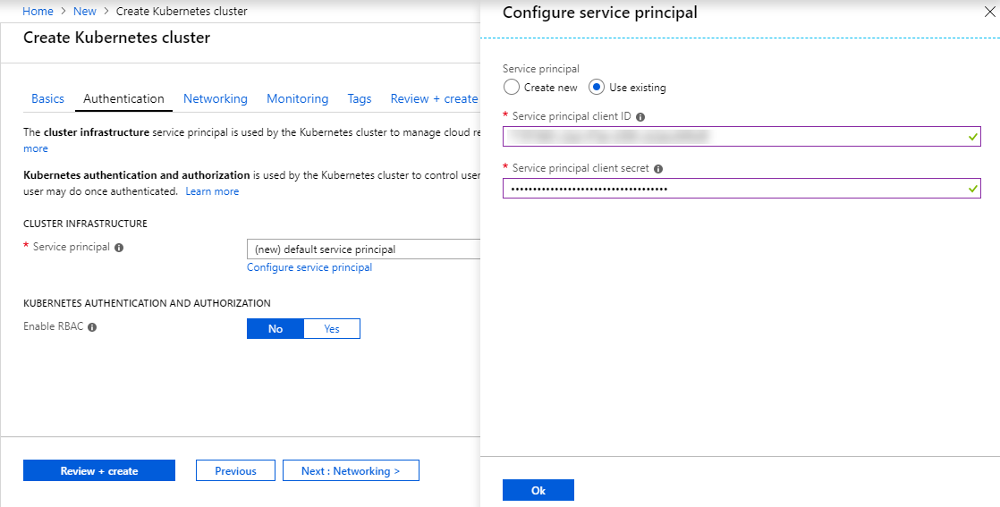

    * Configure your VM size.

        * Click "Change Size".
        * Search for "D2_v2".
        * Select "D2_v2".

            

    * Set the Node Count to 2.

        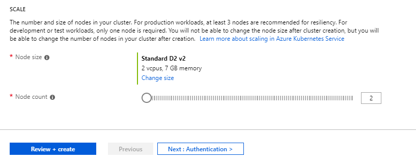

3. Select "Next: Networking".
4. Keep the defaults and select "Next: Monitoring".
5. Keep the defaults and select "Next: Tags".
6. Keep the defaults and select "Review + create".
7. You should see that validation passed; select "Create".

8.  On the Summary blade, you should see that validation passed; select **OK**.

    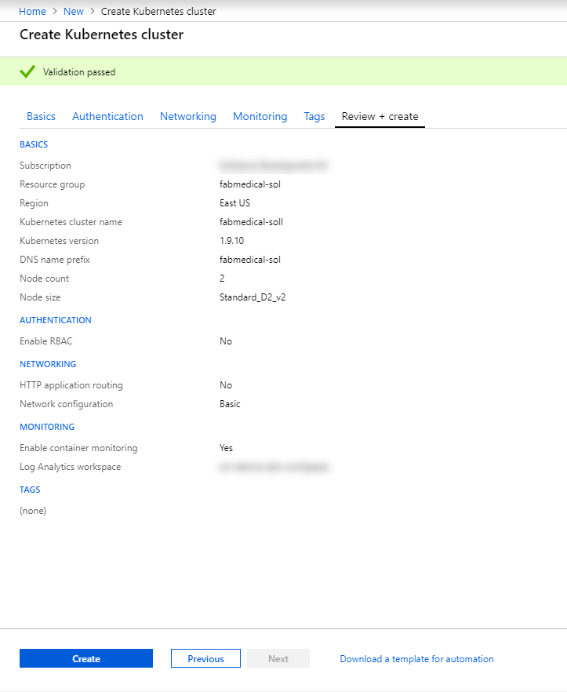

9.  The Azure Kubernetes Service cluster will begin deployment to your Azure subscription. You should see a successful deployment notification when the cluster is ready. It can take up to 10 minutes before your Azure Kubernetes Service cluster is listed in the Azure Portal. You can proceed to the next step while waiting for this to complete, then return to view the success of the deployment.

    

> **NOTE: If you experience errors related to lack of available cores, you may have to delete some other compute resources or request additional cores to your subscription and then try this again.**

### Task 11: Install Azure CLI

In later exercises, you will need the Azure CLI 2.0 to connect to your Kubernetes cluster and run commands from your local machine. A complete list of instructions for supported platforms is available on this page:

<https://docs.microsoft.com/en-us/cli/azure/install-azure-cli?view=azure-cli-latest>

1.  For MacOS -- use homebrew:

    ``` bash
    brew update

    brew install azure-cli
    ```

2.  For Windows -- using WSL _on your local machine (not the build agent)_:

    ``` bash
    AZ_REPO=$(lsb_release -cs)
    echo "deb [arch=amd64] https://packages.microsoft.com/repos/azure-cli/ $AZ_REPO main" | sudo tee /etc/apt/sources.list.d/azure-cli.list

    curl -L https://packages.microsoft.com/keys/microsoft.asc | sudo apt-key add -

    sudo apt-get install apt-transport-https
    sudo apt-get update && sudo apt-get install azure-cli
    ```

### Task 12: Install Kubernetes CLI

In later exercises, you will need the Kubernetes CLI (kubectl) to deploy to your Kubernetes cluster and run commands from your local machine.

1.  Install the Kubernetes client using Azure CLI:

    ``` bash
    az login

    sudo az acs kubernetes install-cli --install-location /usr/local/bin/kubectl
    ```

### Task 13: Download the FabMedical starter files

FabMedical has provided starter files for you. They have taken a copy of one of their websites, for their customer Contoso Neuro, and refactored it from a single node.js site into a website with a content API that serves up the speakers and sessions. This is a starting point to validate the containerization of their websites. They have asked you to use this to help them complete a POC that validates the development workflow for running the website and API as Docker containers and managing them within the Azure Kubernetes Service environment.

1.  From WSL, download the starter files by typing the following curl instruction (case sensitive):

    ```bash
    curl -L -o FabMedical.tgz http://bit.ly/2uhZseT
    ```

2.  Create a new directory named FabMedical by typing in the following command:

    ```bash
    mkdir FabMedical
    ```

3.  Unpack the archive with the following command. This command will extract the files from the archive to the FabMedical directory you created. The directory is case sensitive when you navigate to it.

    ```bash
    tar -C FabMedical -xzf FabMedical.tgz
    ```

4.  Navigate to FabMedical folder and list the contents.

    ```bash
    cd FabMedical

    ll
    ```

5.  You'll see the listing includes three folders, one for the web site, another for the content API and one to initialize API data:

    ```bash
    content-api/
    content-init/
    content-web/
    ```

6.  Next log into your VisualStudio.com account.

    If this is your first time logging into this account you will be taken through a first-run experience:

    * Confirm your contact information and select next.
    * Select "Create new account".
    * Enter a fabmedical-SUFFIX for your account name and select Continue.

7.  Create repositories to host the code.

    * Select the icon in the top left corner to return to the account home page.

        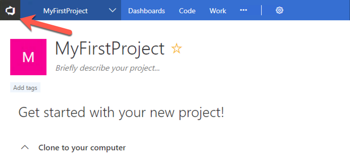
        
    * Select "New Project".
        * Enter fabmedical as the project name.
        * Select "Create".
        
    * Once the project creation has completed, select "Code".
    
    * Use the repository dropdown to create a new repository by selecting "+ New repository".
    
        
           
    * Enter "content-web" as the repository name.
    
    * Once the project is created click "Generate Git credentials".
    
        
          
        * Enter a password.
        * Confirm the password.
        * Select "Save Git Credentials".
        
    * Using your WSL window, initialize a new git repository.

        ```bash
        cd content-web
        git init
        git add .
        git commit -m "Initial Commit"
        ```
    * Setup your VisualStudio.com repository as a new remote the push.  You can copy the commands to do this from your browser.  Paste these commands into your WSL window.
    
        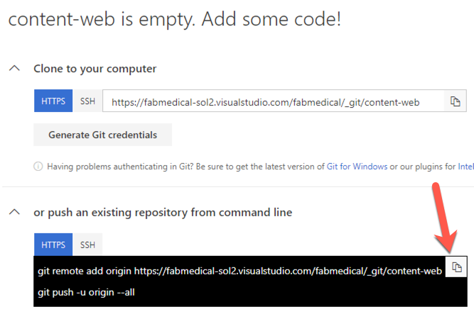
        
        * When prompted, enter your VisualStudio.com username and the git credentials password you created earlier in this task.
        
    * Use the repository dropdown to create a second repository called "content-api".
    
        * Using your WSL window, initialize a new git repository in the content-api directory.
        
            ```bash
            cd ../content-api
            git init
            git add .
            git commit -m "Initial Commit"
            ```
        * Setup your VisualStudio.com repository as a new remote the push.  Use the repository dropdown to switch to the "content-api" repository. You can then copy the commands for the setting up the content-api repository  from your browser.  Paste these commands into your WSL window.
        
        * When prompted, enter your VisualStudio.com username and the git credentials password you created earlier in this task.
        
    * Use the repository dropdown to create a third repository called "content-init".
    
        * Using your WSL window, initialize a new git repository in the content-init directory.
        
            ```bash
            cd ../content-init
            git init
            git add .
            git commit -m "Initial Commit"
            ```
        * Setup your VisualStudio.com repository as a new remote the push.  Use the repository dropdown to switch to the "content-init" repository. You can then copy the commands for the setting up the content-init repository  from your browser.  Paste these commands into your WSL window.
        
        * When prompted, enter your VisualStudio.com username and the git credentials password you created earlier in this task.

8.  Clone your repositories to the build agent.

    * From WSL, connect to the build agent VM as you did previously in Before the hands-on lab - Task 6: Connect securely to the build agent using the SSH command.

    * In your browser, switch to the "content-web" repository and click "Clone" in the right corner.

        

    * Copy the repository url.

    * Use the repository url to clone the content-web code to your build agent machine.

        ```bash
        git clone <REPOSITORY_URL>
        ```

    * In your browser, switch to the "content-api" repository and select "Clone" to see and copy the repository url.

    * Use the repository url and `git clone` to copy the content-api code to your build agent.

    * In your browser, switch to the "content-init" repository and select "Clone" to see and copy the repository url.

    * Use the repository url and `git clone` to copy the content-init code to your build agent.

>**NOTE: Keep this WSL window open as your build agent SSH connection. You will later open new WSL sessions to other machines.**

You should follow all steps provided *before* performing the Hands-on lab.

